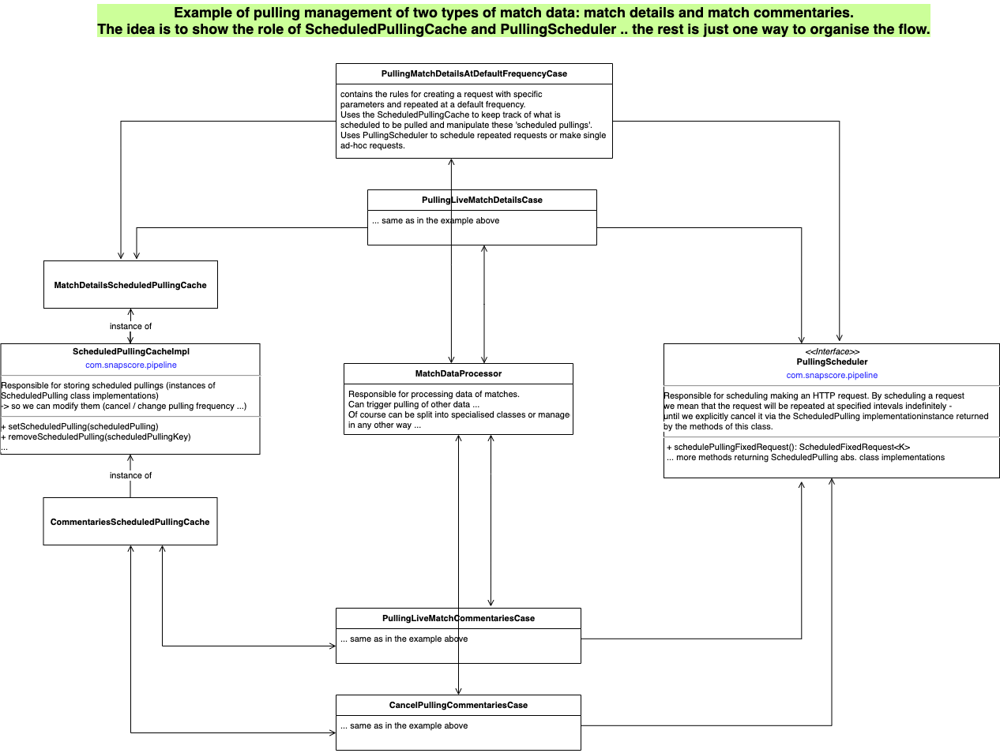

# Pipeline

currently the functionality covers these two areas:

- centralised JSON logging
- pulling feeds from providers


### Centralised JSON logging

- Provides functionality for centralised logging managed by Kibana. Example logging configuration is found here: resources/logback_example.xml
- The single main class to use in projects is ***Logger*** which is used to create the log messages but also enables fluently configure
something called ***MDCProps*** that will be used to pupulate a predefined set of fields in the output JSON. These fields for example contain event ids
and can be used by Kibana for indexing and thus enable faster queries

Some usage examples can be found in the test class: 
```
com.snapscore.pipeline.logging.LoggerExamplesTest
```

### Pulling feeds

The library provides a number of features to solve common usecases when pulling data from providers:
- basic implementations/wrappers of HTTP clients for Vertx and OkHttp; Both implementations fully replaceable by custom implementations if needed
- schedule regular pulling of data at predefined interval
- schedule one-time pulling of data
- automatic retry if a request fails by customisable rules
- configurable request rate per second limit
- prioritising incoming requests so that more important requests go through first (e.g. live match data)
- request de-duplication - for cases when requests are made too fast and previously made requests for the same resource are still not processed -> then new requests can be optionally ignored

Beside this there is basic support for managing existing scheduled pulling by tracking what we have scheduled for pulling inside ****ScheduledPullingCache**** so we can easily:
- change the frequency of existing scheduled pulling if needed (based on any rules defined by the provider impl.)
- cancel existing scheduled pulling (based on any rule defined by the provider impl.)

The general idea behind using a ***ScheduledPullingCache*** is to enforce a 'managed' access to everything that is pulled, so that the rules/cases for the pulling of feeds are easier implemented and understood.

Some usage examples can be found in the test class: 
```
com.snapscore.pipeline.pulling.PullingLibExampleUsages
```
  



#####Example basic setup in provider implementations:
```
PullingStatisticsService pullingStatisticsService = new PullingStatisticsServiceImpl();
int bufferSize = 4194304 * 10;  // 40 MB
HttpClientOptions httpClientOptions = createOptions(httpClientConfig.readTimeout(), bufferSize);
ClientCallbackFactory<VertxClientCallback> clientCallbackFactory = new VertxClientCallbackFactoryImpl(pullingStatisticsService, bufferSize);
HttpClient httpClient = new VertxHttpClientImpl(httpClientConfig, httpClientOptions, clientCallbackFactory);

int requestsPerSecondLimit = 500;
RequestsPerSecondCounter requestsPerSecondCounter = new RequestsPerSecondCounterImpl(requestsPerSecondLimit);
Comparator<FeedRequest> feedRequestPriorityComparator = null; // TODO ... provide custom implementation;
WaitingRequestsTracker waitingRequestsTracker = new WaitingRequestsTrackerImpl(feedRequest -> feedRequest.getUrl());
PullingSchedulerQueue pullingSchedulerQueue = new PullingSchedulerQueueImpl(httpClient, waitingRequestsTracker, requestsPerSecondCounter, feedRequestPriorityComparator);
PullingScheduler pullingScheduler = new PullingSchedulerImpl(pullingSchedulerQueue);
```

```
private HttpClientOptions createOptions(Duration connectTimeout, int bufferSize) {
    HttpClientOptions options = new HttpClientOptions()
            .setTryUseCompression(true)
            .setKeepAlive(true)
            .setConnectTimeout((int) connectTimeout.toMillis())
            .setKeepAliveTimeout(20)
            .setMaxPoolSize(512)
            .setPoolCleanerPeriod(30000)
            .setIdleTimeout(30).setIdleTimeoutUnit(TimeUnit.SECONDS)
            .setTcpNoDelay(true)
            .setUsePooledBuffers(true)
            .setSendBufferSize(4096)
            .setReceiveBufferSize(bufferSize)
            .setLogActivity(false)
            .setSsl(true)
            .setVerifyHost(false)
            .setTrustAll(true)
            .addEnabledSecureTransportProtocol("TLSv1.2");
    return options;
}
```
